# Ch0 · Harness Architecture 總覽與設計原則

> Multi-Agent 高品質系統的架構設計指南
> 通用四階段骨架，可套用於產品發現、競品監控、投資研究等場景

---

## 為什麼是 Harness，不是 Agent

2025 年大家在比誰的 Agent 更聰明。2026 年的共識是：**Model 是商品，Harness 才是護城河。**

同一個模型（Claude、GPT、Gemini）在不同的 Harness 下表現天差地別。Manus 用相同的基礎模型重寫了五次 Harness，每次都提升了可靠性——Meta 最終以約 20 億美元收購的不是模型，是那個 Harness。Vercel 移除了 80% 的 Agent 工具，結果反而更好。

Agent 是大腦，Harness 是身體。沒有身體的大腦什麼也做不了。

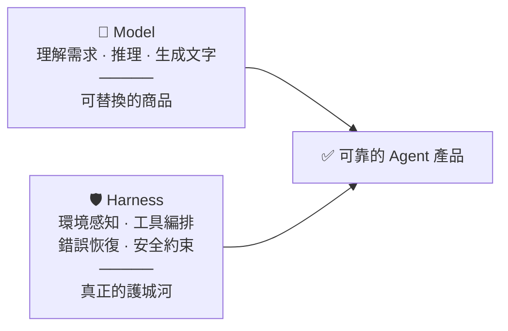

---

## 五層嵌套架構

架構由外到內分五層。外層包住內層，提供約束和服務。

### Fig A · Layer relationships

<svg width="100%" viewBox="0 0 680 540" xmlns="http://www.w3.org/2000/svg">
<style>
  .ring-label { font-family: sans-serif; font-size: 12px; fill: #888; text-anchor: middle; }
  .center-title { font-family: sans-serif; font-size: 14px; font-weight: 500; fill: #555; text-anchor: middle; }
  .center-sub { font-family: sans-serif; font-size: 12px; fill: #999; text-anchor: middle; }
  .badge text { font-family: sans-serif; font-size: 11px; text-anchor: middle; dominant-baseline: central; }
  .leader { stroke: #ccc; stroke-width: 0.5; stroke-dasharray: 3 2; }
  .arr-line { stroke: #bbb; stroke-width: 1; }
  @media (prefers-color-scheme: dark) {
    .ring-label { fill: #888; }
    .center-title { fill: #ccc; }
    .center-sub { fill: #777; }
    .leader { stroke: #555; }
    .arr-line { stroke: #555; }
    .badge-teal rect { fill: #085041; stroke: #5DCAA5; } .badge-teal text { fill: #9FE1CB; }
    .badge-blue rect { fill: #0C447C; stroke: #85B7EB; } .badge-blue text { fill: #B5D4F4; }
    .badge-coral rect { fill: #712B13; stroke: #F0997B; } .badge-coral text { fill: #F5C4B3; }
    .badge-pink rect { fill: #72243E; stroke: #ED93B1; } .badge-pink text { fill: #F4C0D1; }
    .badge-amber rect { fill: #633806; stroke: #FAC775; } .badge-amber text { fill: #FAC775; }
    .badge-gray rect { fill: #444441; stroke: #B4B2A9; } .badge-gray text { fill: #D3D1C7; }
    .badge-purple rect { fill: #3C3489; stroke: #AFA9EC; } .badge-purple text { fill: #CECBF6; }
  }
  @media (prefers-color-scheme: light) {
    .badge-teal rect { fill: #E1F5EE; stroke: #0F6E56; } .badge-teal text { fill: #085041; }
    .badge-blue rect { fill: #E6F1FB; stroke: #185FA5; } .badge-blue text { fill: #0C447C; }
    .badge-coral rect { fill: #FAECE7; stroke: #993C1D; } .badge-coral text { fill: #712B13; }
    .badge-pink rect { fill: #FBEAF0; stroke: #993556; } .badge-pink text { fill: #72243E; }
    .badge-amber rect { fill: #FAEEDA; stroke: #854F0B; } .badge-amber text { fill: #633806; }
    .badge-gray rect { fill: #F1EFE8; stroke: #5F5E5A; } .badge-gray text { fill: #444441; }
    .badge-purple rect { fill: #EEEDFE; stroke: #534AB7; } .badge-purple text { fill: #3C3489; }
  }
</style>

<circle cx="340" cy="270" r="215" fill="none" stroke="#4ecdc4" stroke-width="0.9" stroke-dasharray="4 3" opacity="0.45"/>
<circle cx="340" cy="270" r="145" fill="none" stroke="#4ecdc4" stroke-width="0.5" opacity="0.3"/>
<circle cx="340" cy="270" r="75" fill="none" stroke="#4ecdc4" stroke-width="0.5" opacity="0.2"/>

<text class="center-title" x="340" y="266" dominant-baseline="central">L4 · Agent</text>
<text class="center-sub" x="340" y="284">Specialized AI workers</text>
<text class="ring-label" x="340" y="136">L2 · Context + L3 · Pipeline</text>
<text class="ring-label" x="340" y="64" opacity="0.8">L1 · Harness shell</text>

<g class="badge badge-teal"><rect x="270" y="26" width="140" height="28" rx="6" stroke-width="0.5"/><text x="340" y="40">L1 · Authority</text></g>
<g class="badge badge-blue"><rect x="524" y="120" width="146" height="28" rx="6" stroke-width="0.5"/><text x="597" y="134">L1 · Observability</text></g>
<g class="badge badge-coral"><rect x="536" y="310" width="140" height="28" rx="6" stroke-width="0.5"/><text x="606" y="324">L1 · Error recovery</text></g>
<g class="badge badge-pink"><rect x="518" y="410" width="162" height="28" rx="6" stroke-width="0.5"/><text x="599" y="424">L1 · Self-improvement</text></g>
<g class="badge badge-teal"><rect x="6" y="178" width="172" height="28" rx="6" stroke-width="0.5"/><text x="92" y="192">L3 · Deterministic pipeline</text></g>
<g class="badge badge-amber"><rect x="30" y="410" width="126" height="28" rx="6" stroke-width="0.5"/><text x="93" y="424">L3 · Eval gate</text></g>
<g class="badge badge-blue"><rect x="8" y="310" width="150" height="28" rx="6" stroke-width="0.5"/><text x="83" y="324">L2 · Context engine</text></g>
<g class="badge badge-gray"><rect x="532" y="220" width="126" height="28" rx="6" stroke-width="0.5"/><text x="595" y="234">L4 · Memory</text></g>

<line class="leader" x1="340" y1="54" x2="340" y2="58"/>
<line class="leader" x1="524" y1="134" x2="500" y2="148"/>
<line class="leader" x1="536" y1="324" x2="512" y2="318"/>
<line class="leader" x1="518" y1="424" x2="490" y2="428"/>
<line class="leader" x1="178" y1="192" x2="204" y2="208"/>
<line class="leader" x1="158" y1="324" x2="200" y2="306"/>
<line class="leader" x1="156" y1="424" x2="200" y2="416"/>
<line class="leader" x1="532" y1="234" x2="506" y2="245"/>

<g class="badge badge-purple"><rect x="278" y="502" width="124" height="30" rx="8" stroke-width="0.5"/><text x="340" y="517">Commander</text></g>
<line class="arr-line" x1="340" y1="485" x2="340" y2="502" marker-end="url(#arrow)"/>
<defs><marker id="arrow" viewBox="0 0 10 10" refX="8" refY="5" markerWidth="6" markerHeight="6" orient="auto-start-reverse"><path d="M2 1L8 5L2 9" fill="none" stroke="context-stroke" stroke-width="1.5" stroke-linecap="round" stroke-linejoin="round"/></marker></defs>

</svg>

### 圖 B · Pipeline 通用流程

任何「從資料到決策」的 Multi-Agent Pipeline 都可以套用這個四階段骨架。

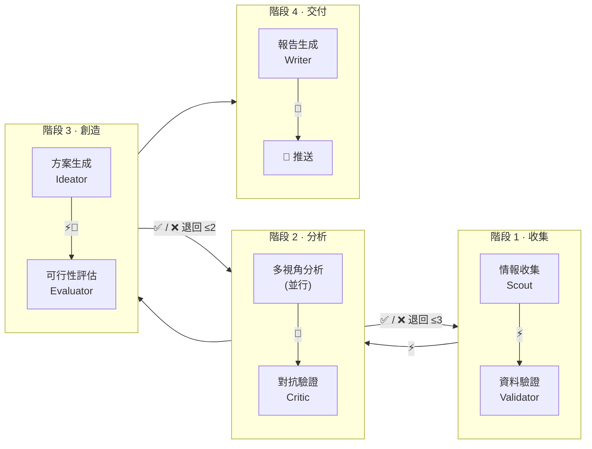

**Eval legend**: ⚡ Deterministic check · 🤖 LLM-as-Judge · 📏 Business metrics · 🎯 Goal success rate

### 場景套用範例

同一個四階段骨架，不同場景只是替換每個 Agent 的具體任務：

| 階段 | iGaming 產品發現 | 競品情報監控 | 投資標的研究 |
|------|-----------------|-------------|-------------|
| **收集** | 爬 X/Reddit 用戶抱怨 | 爬競品官網/更新日誌 | 爬 SEC 財報/新聞 |
| **驗證** | 交叉比對來源、去重 | 比對歷史版本差異 | 驗證數據與官方來源一致 |
| **分析 A** | 市場規模分析 | 功能差異分析 | 財務健康度分析 |
| **分析 B** | 用戶痛點根因分析 | 定價策略分析 | 產業趨勢分析 |
| **分析 C** | 風險評估 | 技術架構推測 | 風險因子分析 |
| **Critic** | 質疑痛點是否真實 | 質疑分析是否有偏見 | 質疑估值假設 |
| **創造** | 產品解決方案設計 | 反制策略設計 | 投資論述撰寫 |
| **評估** | TAM/單位經濟學 | 實施成本/ROI | 估值模型/退出策略 |
| **交付** | 商業計劃報告 | 競品週報 | 投資備忘錄 |

**Eval 圖例**：⚡ 確定性檢查 · 🤖 LLM-as-Judge · 📏 業務指標 · 🎯 目標達成率

---

## 各層職責速覽

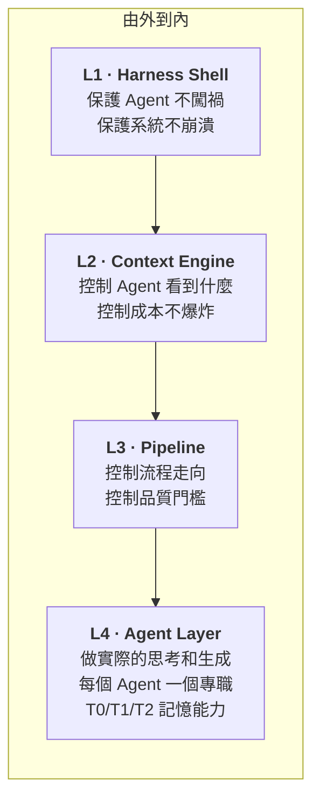

| 層級 | 一句話職責 | 包含的組件 |
|------|----------|-----------|
| **L1** Harness Shell | Agent 的安全邊界和運行環境 | Authority、Observability、Error Recovery、Self-Improvement |
| **L2** Context Engine | 控制每個 step 的 context 輸入 | Initializer Pattern、Filesystem-as-Memory、KV-Cache 策略、T1→T2 精煉 |
| **L3** Pipeline | 確定性流程編排 + 品質門檻 | Step 順序定義、Eval Gate（四種類型）、退回迴圈 |
| **L4** Agent Layer | 專職化 AI 執行任務 + 記憶能力 | Agent 角色/prompt/工具/模型定義、**Memory (T0/T1/T2)** |
| **外部** | 人類與交付 | Commander、交付通道（Telegram/Notion/Slack） |

---

## 組件層級歸屬總表

快速查找「某個組件在哪一層」。

| 組件 | 層級 | 說明 |
|------|------|------|
| Authority (權限模型) | **L1** | Model 決定做什麼 ≠ System 允許做什麼 |
| Observability (可觀測性) | **L1** | Token/cost 監控、動作追溯、失敗聚類 |
| Error Recovery (錯誤恢復) | **L1** | API 失敗→重試→escalate 人類 |
| Self-Improvement (自我改善) | **L1** | 錯誤→永久約束、build for deletion |
| Initializer Pattern | **L2** | 每 step 乾淨 context 注入，切斷 rot 傳播 |
| Filesystem-as-Memory | **L2** | 完整產出寫檔，摘要進 context |
| KV-Cache Prompt 結構 | **L2** | 穩定前綴 + append-only + 確定性序列化 |
| T1→T2 精煉週期 | **L2** | 跨日記憶壓縮，防長期 context rot |
| Step 順序定義 | **L3** | YAML/Flows 確定性控制 |
| Eval Gate | **L3** | 每 step 出口的品質/格式門檻 |
| 退回迴圈 (品質) | **L3** | Critic fail → 退回重做（有上限） |
| 退回迴圈 (錯誤) | **L1** | 工具失敗 → 重試 → escalate（屬 Harness 層） |
| Agent 角色定義 | **L4** | 專職化角色 + temperature + 模型層級 |
| T0 identity / T1 working memory / T2 long-term knowledge | **L4** | Agent's memory — identity, daily logs, distilled knowledge |
| Human-in-the-Loop | **外部** | Commander 審閱、高風險操作審批 |
| 交付通道 | **外部** | Telegram / Notion / Slack |

---

## 設計原則

### 原則 1 · 確定性引擎控制流程，Agent 只做創意工作

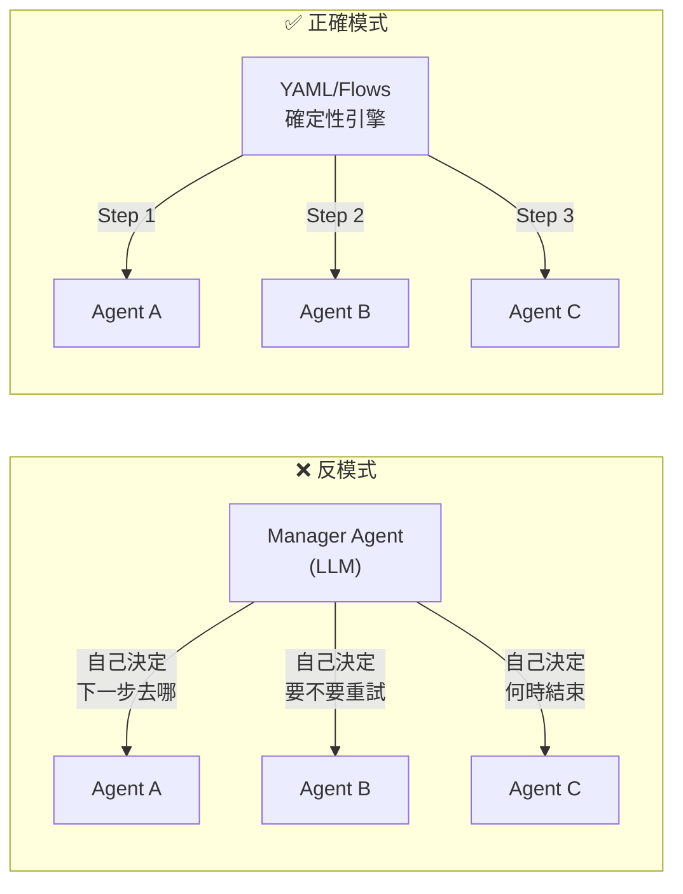

讓 LLM 決定流程走向，在小專案可以，在大型系統中會跳步驟、循環依賴、卡在分析迴圈。Agent 擅長在有界問題內生成內容，但對流程排序的元層級決策力很差。

### 原則 2 · 專職化 Agent，不要萬能 Agent

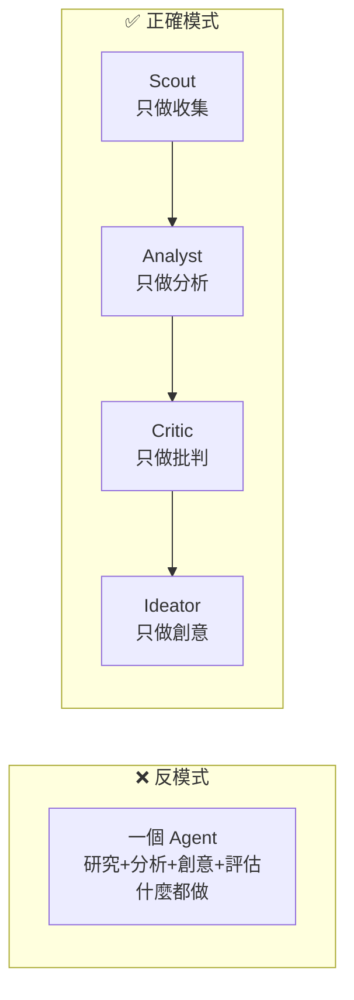

專職化 agent 組合在一起，永遠比一個萬能 agent 效果好。同一份資料餵給不同視角的 analyst，產出比單一分析師更全面。

### 原則 3 · 每個 Step 嵌入 Eval Gate

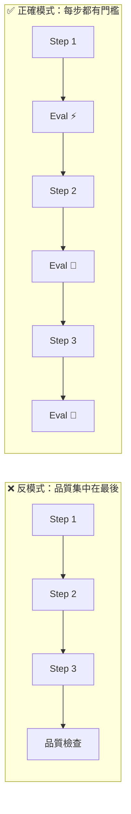

垃圾進、垃圾出。如果 S1 收集了假資料，沒有 Eval Gate，這份假資料會一路傳到 S8 最終報告。每個 step 出口攔截，越早發現問題成本越低。

四種 Eval 類型按需選配：

| 類型 | 符號 | 成本 | 適用場景 |
|------|------|------|---------|
| 確定性檢查 | ⚡ | 零 | 格式、數量、來源 URL 驗證 |
| LLM-as-Judge | 🤖 | 中 | 邏輯一致性、品質評分 |
| 自定義業務指標 | 📏 | 低 | 領域特定 KPI（TAM 可驗證？競品 ≥ 3？） |
| 目標達成率 | 🎯 | 中 | 最終任務是否完成、是否可執行 |

### 原則 4 · Model 決定做什麼 ≠ System 允許做什麼

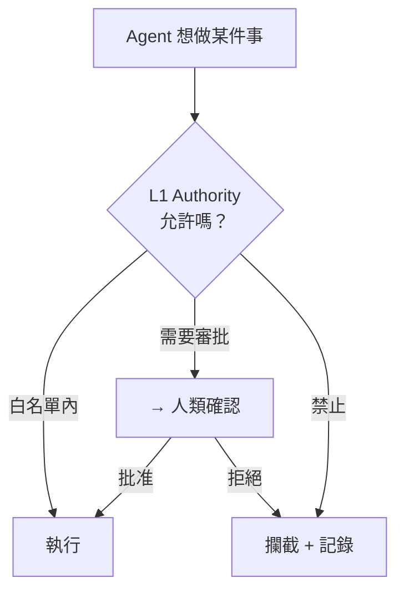

Agent 的能力和權限是兩回事。Scout 有能力發推文（它能呼叫 X API），但 Authority Layer 不允許它這樣做。所有外部 API 呼叫必須在白名單內，付費操作需要人類批准，這兩層檢查在架構上和 Agent 的推理分離。

### 原則 5 · 減法優於加法

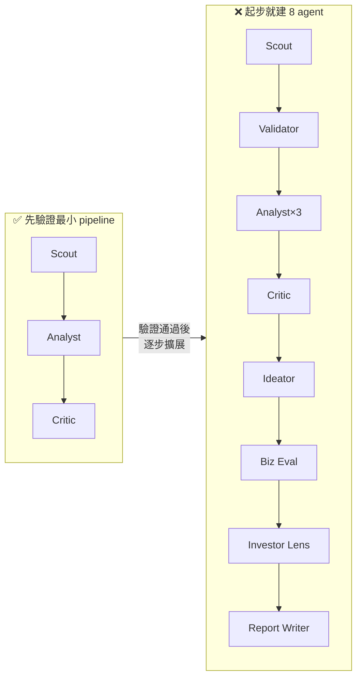

Vercel 移除 80% 工具反而更好。Manus 花俏的子 agent 路由被結構化交接取代。先用 3 個角色跑通，驗證「能從 X 上挖到真實 iGaming 痛點」，再逐步加 agent。每次新增都要問：「這個 agent 解決了什麼 3 agent 版本解決不了的問題？」

### 原則 6 · Build for Deletion

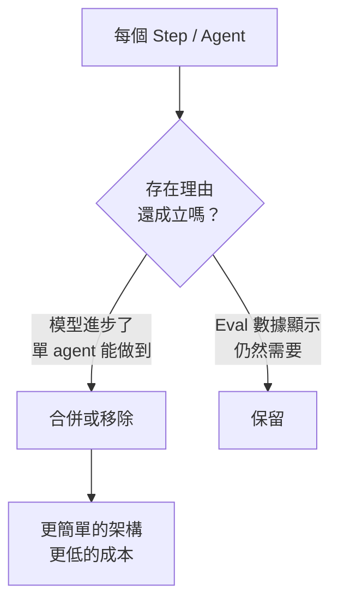

每段 Harness 邏輯都應有過期日。如果下一代模型能在沒有你的鷹架下完成某件事，就刪掉鷹架。每個 step 標註「存在理由」和「移除條件」，模型升級時定期重新評估。

### 原則 7 · 信任是漸進建立的

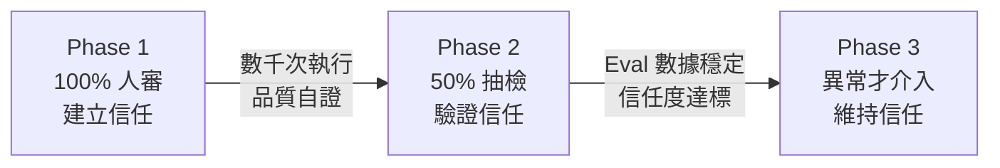

不要第一天就全自動。從 100% 人工審查起步，用 eval 數據驅動降低人工介入比例。社群經驗是改善速度比預期快——花幾週而非幾個月。

---

## IMPACT Checklist — 每個 Agent 上線前必查

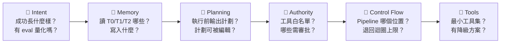

| 維度 | 層級歸屬 | 核心問題 |
|------|---------|---------|
| 🎯 **Intent** | L3 (Eval) | 這個 step 的 pass/fail 標準是什麼？ |
| 🧠 **Memory** | L4 | 需要讀寫哪些記憶層？ |
| 📝 **Planning** | L3 | Agent 執行前會輸出可審閱的計劃嗎？ |
| 🔐 **Authority** | L1 | 工具白名單和人類審批點定義了嗎？ |
| 🔀 **Control Flow** | L3 | 在 pipeline 的位置、退回迴圈上限？ |
| 🔧 **Tools** | L1 + L4 | 是最小工具集嗎？失敗時有降級方案嗎？ |

---

## 本章小結

```
一句話總結：

  Harness（L1 security）
    wraps Context（L2）
    wraps Pipeline（L3）
    wraps Agent + Memory（L4）
    Commander retains final control

  Model 是可替換的零件。
  Harness 是你的產品。
```

**後續章節**：Ch1-Ch5 分別展開每一層的詳細設計，Ch6 處理模型選型，Ch7 是部署路線圖。
